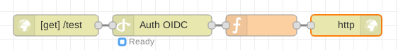

# node-red-contrib-auth-oidc

[Node-RED][nodered] node to use OpenID Connect with HTTP input nodes.



## Install

Run the following command in the root directory of your Node-RED install

```bash
npm install node-red-contrib-auth-oidc
```

## Usage

You have to configure the node by setting the discovery URL of you OpenID
Connect provider.

For example the discovery URL of Google is:
https://accounts.google.com/.well-known/openid-configuration

This node extract and validate the access token from HTTP headers
(`Authorization: Bearer XXX`).

Decoded token (JWT) is stored into the property `msg.token`.
The token is decoded (JWT) and stored into the message property: `msg.token`.

[nodered]: https://nodered.org/
[node-openid-client]: https://github.com/panva/node-openid-client

